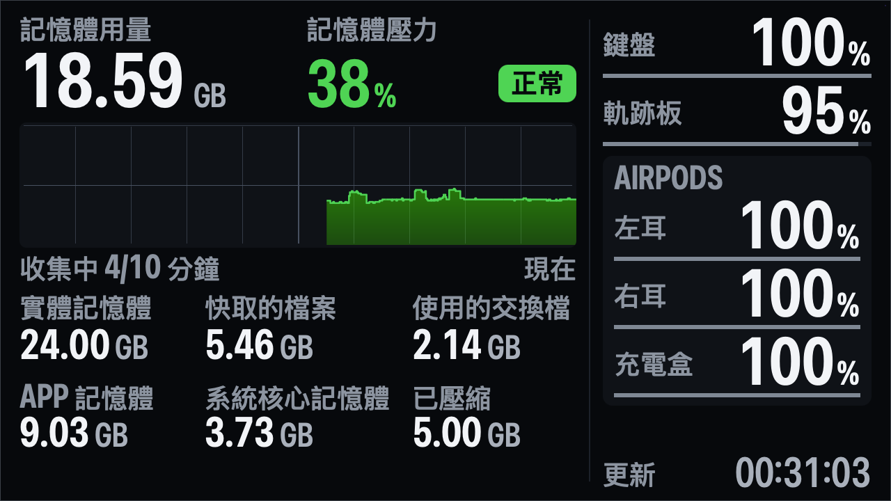
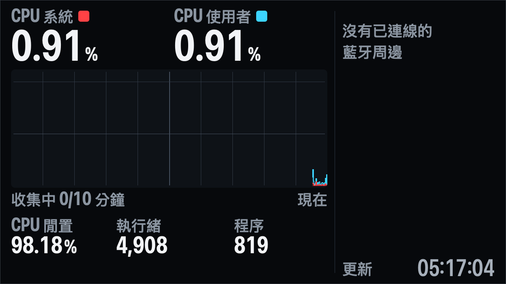
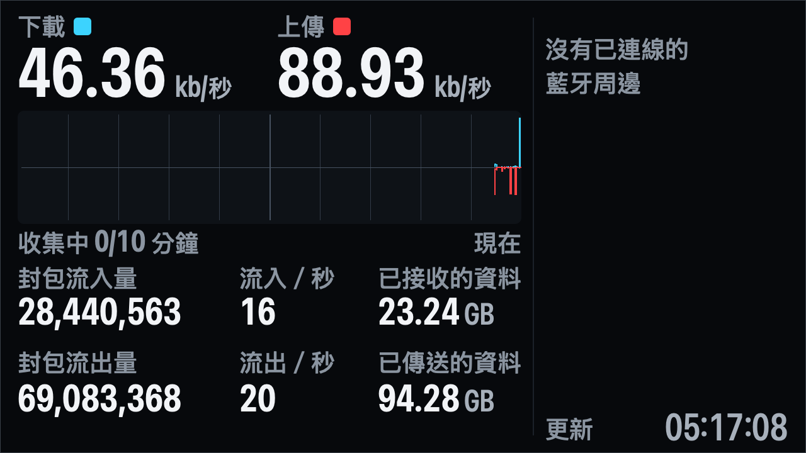

# Wokyis Panel

繁體中文（main document）: [README.md](README.md)

A native macOS app that keeps a large-type dashboard full screen on the Wokyis 5-inch display attached to a Mac mini
(1280×720 at 1x). It has three views, each reproducing the footer of an Activity Monitor (AM) tab, plus a column with
the battery levels of connected Bluetooth peripherals (keyboard, trackpad, mouse, AirPods left / right / case):

| View | Content |
|---|---|
| Memory | AM Memory tab footer: Memory Used, Memory Pressure (percentage, level pill, 10-minute history), Physical, Cached Files, Swap Used, App, Wired, Compressed |
| CPU | AM CPU tab footer: CPU System, CPU User, CPU Idle, Threads, Processes, 10-minute CPU load graph |
| Network | AM Network tab footer: Download / Upload speed, Packets In / Out, Packets In/Sec / Out/Sec, Data Received / Sent, 10-minute DATA graph |







This file covers operating the panel. The data sources, formulas, AM reverse engineering, log formats and acceptance
evidence are kept in one place only, the Chinese [README.md](README.md) (sections 8–10), so they cannot drift apart.

## Requirements

- Apple Silicon Mac, macOS 14 or later; the Wokyis as an extended desktop (not mirrored), 1280×720 @1x.
- System Settings → Desktop & Dock → "Displays have separate Spaces" on, so the full-screen panel covers only the Wokyis.
  The panel never changes system settings.
- Xcode command-line `swiftc` and `codesign`. No sudo, no network, no third-party packages, no Bluetooth or
  Accessibility permission (battery data comes from IOKit, IOPS and `system_profiler`; hot keys use Carbon).

## Build

```sh
scripts/build.sh
```

Offline, bash 3.2: `swiftc` with an explicit source list (AppKit, IOKit, CoreText, Carbon) →
`build/WokyisPanel.app` → ad-hoc signature → `WokyisPanel --selftest` (any failure fails the build) →
`tools/build.sh` (verification tools and their self tests; `SKIP_TOOLS=1` skips it). `Sources/Evidence/` is build
source code, not evidence output: commit it together with the rest of `Sources/`.

### Install from GitHub Releases

Download `WokyisPanel-<version>.dmg` from [Releases](https://github.com/kakapo1933/wokyis-dashboard/releases),
open it and drag `WokyisPanel.app` to Applications. Requirements as above (Apple Silicon, macOS 14 or later, the
Wokyis as an extended desktop, "Displays have separate Spaces" on).

- The app is ad-hoc signed only (no Developer ID signature or notarization), so macOS blocks the first launch. In the
  "WokyisPanel" Not Opened dialog click Done (not Move to Trash), then open System Settings → Privacy & Security, find
  the message that WokyisPanel was blocked and click Open Anyway; confirm (password or Touch ID may be asked). Or remove
  the download flag: `xattr -dr com.apple.quarantine /Applications/WokyisPanel.app`.
- It finds the Wokyis and goes full screen by itself (and waits while no Wokyis is connected). The UI defaults to
  Traditional Chinese (⌃⌥⌘L or Language ▸ English switches it), so quit from the menu-bar icon → 結束 Wokyis 面板
  ("Quit Wokyis Panel" in English).
- Started by LaunchServices (Finder, Dock, Login Items) the app has no command-line arguments; its logs and run files go
  to `~/Library/Application Support/WokyisPanel/{logs,run}/` (`logs/current.log`). Saved settings are shared with the
  checkout's build. `scripts/status.sh`, `stop.sh` and `logs.sh` manage only the panel in the checkout's `build/`;
  `stop.sh` just notes another running copy and leaves it alone.
- One panel per user: any two copies exclude each other through a lock in `$TMPDIR`; the one started second logs
  `ERR src=instance err=already_running` and exits without touching `current.log` (an installed app opened while the
  other runs seems to do nothing: quit the other one first).
- Start at login (optional): System Settings → General → Login Items & Extensions (Login Items on macOS 14) → Open at
  Login → +. Uninstall: quit, move the app to the Trash, and optionally delete `~/Library/Application Support/WokyisPanel/`
  and run `defaults delete io.github.kakapo1933.wokyis-panel` (this also resets the checkout build's saved settings).

Packaging: `scripts/package.sh` runs `scripts/build.sh` (without tools) and writes `dist/WokyisPanel-<version>.dmg`
and its `.sha256`. The disk image opens as a classic-Macintosh copy window: `Resources/dmg/make_background.swift` draws
the background (1x pixel art, 2x scaled nearest-neighbour), `Resources/dmg/layout.applescript` has Finder lay out the
window and icons (stored in the volume's `.DS_Store`), and the app icon becomes the volume icon. So the volume
"Wokyis Panel <version>" must not be mounted, the first run asks to let the terminal control Finder (Privacy &
Security → Automation), and `TITLE_BAR=<pt>` overrides the Finder title-bar height (default 32, measured on macOS 27).
The version is the app's `Info.plist` (copied from `Resources/Info.plist`; with `SKIP_BUILD=1` the existing
`build/WokyisPanel.app` is packaged as is). Each run produces different bytes: after uploading, re-upload the DMG and
`.sha256` together if you package again.

## Start, stop, status

```sh
scripts/start.sh                    # foreground; Ctrl+C stops gracefully (a second Ctrl+C exits at once)
scripts/start.sh --bg               # background (nohup); stdout in logs/stdout-<ts>.log
scripts/start.sh --bg -- --view cpu --lang en   # extra arguments go to WokyisPanel
scripts/status.sh                   # pid, CPU / memory, last log line per kind, current view / language / battery column
scripts/logs.sh                     # tail -F logs/current.log
scripts/stop.sh                     # SIGTERM, waits up to 6 s, cleans up system_profiler children; deletes no file
```

Single instance (a per-user lock in `$TMPDIR` shared by every copy, e.g. an installed one, plus `run/panel.pid`).
After start the panel creates its window on the Wokyis, enters native full screen and gives focus back to the
previously active app. Switch between the panel and other full-screen apps on the Wokyis with Ctrl+←/→ (pointer on the
Wokyis), Cmd+Tab or the Dock. `scripts/fullscreen.sh` re-enters full screen after you left it yourself; when the
Wokyis disconnects and comes back the panel re-creates its full-screen window by itself. While the screen is locked
the panel creates no window and never tries full screen (`WIN event=waiting_for_unlock`; a full-screen failure while
locked does not count toward the 3-failure manual lock); after the unlock (`WIN event=unlocked`) it waits 3 s of
stable screens and enters full screen on the Wokyis by itself, within the same 3-attempts-per-10-minutes limit.
`scripts/fullscreen.sh` while locked also waits (a windowed panel is closed instead of toggled); a request deferred by
the lock (start, `scripts/fullscreen.sh`, a full-screen retry) is replayed once after the unlock (`WIN
event=unlock_replay`), even with `--auto-recover no` and outside that limit.

## Status menu and hot keys

The panel adds a status item to the menu bar (SF Symbol `memorychip` / `cpu` / `network` for the current view).

| Menu item | Hot key | Action |
|---|---|---|
| Memory / CPU / Network (radio) | ⌃⌥⌘M / ⌃⌥⌘P / ⌃⌥⌘N | Show that view |
| Next View | ⌃⌥⌘V | Memory → CPU → Network → Memory |
| Show Bluetooth Battery (checkbox) | ⌃⌥⌘B | Show / hide the battery column (hidden = full-width 1224 px main column) |
| Language ▸ System (…) / 繁體中文 / English (radio) | — | "System (…)" shows what it currently resolves to |
| Language ▸ Switch Language | ⌃⌥⌘L | Toggles between 繁體中文 and English (based on what is shown); never selects System |
| Quit Wokyis Panel | — | Same graceful exit as `scripts/stop.sh` |

- Changing the view, the battery column or the language never activates the panel, never takes focus and never
  switches Spaces; it only redraws the panel. If another full-screen app (for example Music) is in front on the Wokyis,
  you see the new view when you switch back to the panel.
- **Shortcuts use the US-layout key positions** (`kVK_ANSI_*`). On AZERTY, Dvorak and other layouts the letter shown in
  the menu may not be the key you have to press.
- Hot-key conflicts with other apps cannot be detected (macOS reports success and both apps fire). Each key's
  registration is logged (`UI event=hotkey_register key=M status=0`); a failed key gets `WARN hotkey_failed` and no
  shortcut in the menu. `--hotkeys no` disables all of them.
- While the menu is open, macOS holds the global hot key until the menu closes, so the change is applied once. If you
  pick an item and press the same shortcut at almost the same moment, both arrive; the same action from the other
  source within 150 ms is ignored (`UI event=dedup`), and for a menu item the 150 ms count from when the menu finished
  closing (the Switch Language submenu closes about 0.25 s after the click).

## Language

The default interface language is Traditional Chinese. **System** follows the first macOS preferred language: one that
starts with `zh` gives Chinese, anything else gives English. System is resolved when the panel starts and again only
when you pick System in the menu or press ⌃⌥⌘L; reordering the macOS languages while the panel runs does not change the
panel until you pick System again.

English labels are upper case. With the battery column shown the main column is 800 px wide, so some labels are
abbreviated:

| Full | Abbreviated (battery column shown) |
|---|---|
| PHYSICAL MEMORY / WIRED MEMORY | PHYSICAL / WIRED |
| PACKETS IN/SEC / PACKETS OUT/SEC | IN/SEC / OUT/SEC |
| DATA RECEIVED / DATA SENT | RECEIVED / SENT |

The battery column always uses KBD / TPAD / MOUSE / DEVICE and LEFT / RIGHT / CASE (BATT for single-battery
headphones). The clock label is `AS OF`; the simulation badge starts with `SIM:`.

**Inverted number = LOW (≤ 20 %)**: in English a low battery level is drawn as a dark number on a white rounded box
(there is no room for a LOW chip); the thicker battery bar is the second cue. The Chinese interface keeps the white 「低」
chip.

Colors: on the memory view green / yellow / red mean only memory pressure. On the CPU and network views red
(#FF4245) and cyan (#3CD3FE) mean only the data series (CPU System / Upload red, CPU User / Download cyan); numbers
are always white, the colors appear only in the small swatch next to each label and in the graph. Magenta means
simulation only.

## Command line and saved settings

| Option | Default | Effect |
|---|---|---|
| `--view memory\|cpu\|network` | saved setting, else memory | View for this run |
| `--battery yes\|no` | saved setting, else yes | Battery column for this run |
| `--lang zh\|en\|system` | saved setting, else zh | Interface language for this run |
| `--hotkeys yes\|no` | yes | Register the ⌃⌥⌘ M/P/N/V/B/L hot keys |
| `--mem-display-hz 4\|2\|1` | 2 | Memory values redrawn at most this often per second (sampling stays at `--mem-hz`) |
| `--log-level summary\|sample` | summary | Log volume (`sample` is needed by `tools/bin/amcompare`) |
| `--snapshot OUT.png [--dump-rects] [--view V] [--lang L] [--battery yes\|no]` | — | Render a fixture offscreen once and exit |

`WokyisPanel --help` lists every option.

Precedence: defaults (memory, battery column, Traditional Chinese) < saved settings < this run's command line. A change
from the menu or a hot key saves exactly the key it changed. `--view`, `--battery` and `--lang` are **never saved**:
starting with `--view cpu --lang en` and pressing ⌃⌥⌘B saves only the battery column. `--selftest`, `--snapshot` and
`--headless` neither read nor write the saved settings.

Saved settings live in the UserDefaults domain `io.github.kakapo1933.wokyis-panel`
(`~/Library/Preferences/io.github.kakapo1933.wokyis-panel.plist`): `ui.view` (memory / cpu / network),
`ui.batteryVisible` (Bool), `ui.language` (system / zh / en). Invalid values are ignored with
`WARN settings_invalid`.

```sh
defaults read io.github.kakapo1933.wokyis-panel     # show
scripts/stop.sh && defaults delete io.github.kakapo1933.wokyis-panel   # reset to the defaults
```

## Simulation

`scripts/sim.sh` writes `run/control.json` to inject failures or a pressure override, for example
`scripts/sim.sh fail net.if --for 60`, `scripts/sim.sh garbage cpu.tasks`, `scripts/sim.sh pressure red 92`,
`scripts/sim.sh clear`. While anything is injected the panel shows a 6 px magenta frame and a badge, and every log line
carries `sim=1`. Source ids and rules: [README.md section 10](README.md#10-模擬與容錯).

## Known limitations (summary)

- Hot-key conflicts cannot be detected; shortcuts are US-layout key positions.
- Language System looks only at the first preferred language (this Mac, with en-TW first, resolves to English).
- With the battery column shown, packet totals of 10 digits or more are abbreviated (`1.23 G`).
- In regions with a decimal comma, byte strings follow the region (as in AM: "22,76 GB") while percentages and
  speeds always use "." ("4.99%").
- The CPU and network footers were compared with AM statistically only (2026-10-02, AM read through AX every 40 ms).
  AM refreshes its footer about every 1.06 s and the panel samples once a second, so values cannot match one for one:
  CPU System/User/Idle differed by a median 0.26–0.88 percentage points and threads by 4–5; network packet totals fell
  between two consecutive panel samples in 496 of 496 refreshes; per-second rates differ by a median 5.7–10 % because
  the windows differ. `amcompare` automates the memory view (Traditional Chinese, battery column shown) only.
- CPU use stays close to, but under, the limit of 2 % of one core averaged over 5 minutes (the "% CPU" figure in
  Activity Monitor; 2 % is about 1.2 s of work per minute). The memory view uses the most, about 1.3–1.7 % (busiest
  5 minutes 1.71 %); the CPU and network views about 0.7–1.3 %, since they update once a second. A single minute can go
  above 2 %. Memory numbers redraw twice a second by default (memory is still read 4 times a second for the graph); at
  4 times a second the memory view once measured 2.09 %. To use even less, quit the panel and run
  `open -a WokyisPanel --args --mem-display-hz 1` (this launch only). For the whole Mac mini this is under 0.2 %.
- The menu bar and the full-screen title bar slide over the top ~60 px when the pointer touches the top edge of the
  Wokyis.
- Logs are never deleted automatically.

Full list: [README.md section 11](README.md#11-已知限制).
