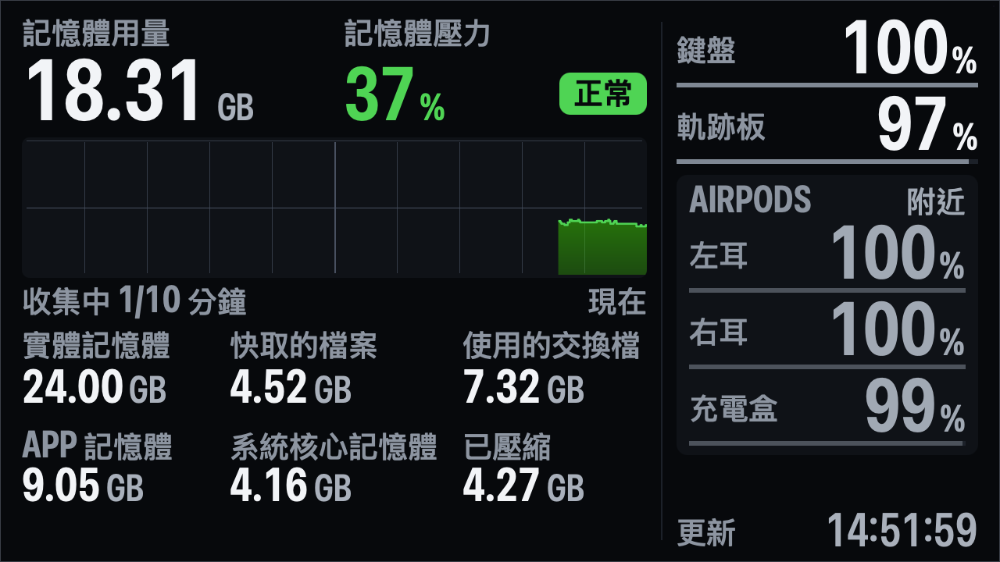

# Wokyis 資訊面板

## 1. 一句話說明與畫面

在 Mac mini 外接的 Wokyis 5 吋小螢幕（1280×720、1 倍縮放）上，以原生全螢幕常駐一塊大字面板：左邊重現活動監視器（以下簡稱 AM）「記憶體」分頁底部的七個數字與記憶體壓力圖，右邊顯示已連線藍牙周邊（鍵盤、軌跡板、滑鼠、AirPods 左耳／右耳／充電盒）的電量。





> Wokyis 實機截圖（1280×720 原生像素）：一般狀態（面板剛啟動，壓力圖左軸「收集中 N/10 分鐘」）、AirPods 沒連到 Mac 時的「附近」灰字、用模擬注入產生的「嚴重」紅色壓力（模擬中會有洋紅外框與徽章）。

目錄：[說明與畫面](#1-一句話說明與畫面)｜[需求與限制](#2-需求與限制)｜[建置](#3-建置)｜[啟動與停止](#4-啟動停止狀態與-log)｜[與其他全螢幕 App 切換](#5-與其他全螢幕-app-切換)｜[技術選型](#6-技術選型理由)｜[畫面說明](#7-畫面說明)｜[資料來源與公式](#8-每個欄位的資料來源與換算公式)｜[更新頻率與 log](#9-更新頻率與-log-格式)｜[模擬與容錯](#10-模擬與容錯)｜[已知限制](#11-已知限制)

---

## 2. 需求與限制

| 項目 | 內容 |
|---|---|
| 硬體 | Apple Silicon Mac（編譯目標 `arm64-apple-macos14.0`）；Wokyis 是延伸桌面（`Mirror: Off`），1280×720 @1x |
| 系統設定 | 「每個顯示器有各自的空間」需開啟（`defaults read com.apple.spaces spans-displays` = `0`），全螢幕才只佔滿 Wokyis。面板不會修改任何系統設定 |
| 工具鏈 | Xcode 內建的 `swiftc`（Swift 6.3.3，以 `-swift-version 5` 語言模式編譯）、`codesign`；驗證工具另用系統內建 `/usr/bin/python3` |
| 權限 | 不需要 sudo、不連網路、不裝第三方套件；不使用 IOBluetooth，因此不需要藍牙權限（不會出現 TCC 對話框） |
| 記憶體 sysctl | 依賴系統提供的 `vm.mte.*` MIB；若某個 MTE free MIB 不存在，自動改用 calibrated 模式（見第 8 節） |
| 不在範圍內 | 開機自動啟動、iPhone／Apple Watch 電量、CPU／GPU／網路等其他指標 |

---

## 3. 建置

```sh
scripts/build.sh
```

`scripts/build.sh`（bash 3.2 相容，完全離線）依序執行，任一步失敗就停止並回傳非 0：

1. `swiftc -O -swift-version 5 -target arm64-apple-macos14.0`，明確列出 `Sources/` 下 29 個檔案，連結 AppKit、IOKit、CoreText，輸出 `build/WokyisPanel.app/Contents/MacOS/WokyisPanel`。
2. 複製 `Resources/Info.plist`（`CFBundleIdentifier=io.github.kakapo1933.wokyis-panel`，沒有任何 `NSBluetooth*` key，沒有 `LSUIElement`）。
3. ad-hoc 簽章：`codesign --force --sign - --timestamp=none`，再用 `codesign --verify --verbose=2` 驗證。
4. 執行 `WokyisPanel --selftest`：Config、Injector、EventLog、記憶體公式與格式、電量解析與合併（含「附近」狀態）、Store／分頁／版面等內建測試（目前 291/291）。任何一項失敗即建置失敗。
5. `tools/build.sh`：建出 `tools/bin/` 下的驗證工具（glyphheight、fontcal、ocr、procstat、composite、mockup、amcompare、edgecheck、winlist、logstats），最後跑 `tools/selftest.sh`（edgecheck、winlist、logstats、amcompare unittest、linkcheck）。

環境變數：`SKIP_TOOLS=1` 略過第 5 步；`TOOLS_SELFTEST=0` 只建工具、不跑工具 selftest。


---

## 4. 啟動、停止、狀態與 log

所有指令都在專案根目錄執行。啟動前先 `scripts/build.sh`。

### 4.1 前景啟動（預設）

```sh
scripts/start.sh                       # 前景執行；終端機看得到輸出
scripts/start.sh --log-level sample    # 額外參數直接傳給 WokyisPanel（也可寫成 scripts/start.sh -- --log-level sample）
```

- `start.sh` 以 `exec` 直接執行面板，參數固定帶 `--log-dir logs --run-dir run`。
- 終端機（stdout）只會出現：`START` 與事件行（`WIN`、`ERR`、`RECOVER`、`WARN`、`DEV`、`CTL`、`STOP` 等），以及每 10 秒一行 `SUM` 摘要（`--summary-seconds` 可改）。每 250 ms 一筆的 `MEM` 等細節只寫進 log 檔，不會洗版。
- 單一實例：`run/panel.pid` 指向另一支活著的 WokyisPanel 時，`start.sh` 拒絕啟動（rc=1）；面板本身也會再檢查一次（`ERR src=pidfile err=already_running`、exit 1）。
- 啟動後面板在 Wokyis 建窗、進入原生全螢幕，再把焦點還給啟動前的前景 App（只搶焦點約 50 ms）。`--no-focus-restore` 可關閉。

視窗相關參數（完整清單見 `WokyisPanel --help`）：

| 參數 | 預設 | 作用 |
|---|---|---|
| `--display-id N` | 自動尋找 | 強制指定 Wokyis 的 CGDirectDisplayID（找不到該 id 就不建窗） |
| `--no-focus-restore` | 會還原 | 進入全螢幕後不把焦點還給先前的前景 App |
| `--auto-recover yes\|no` | `yes` | Wokyis 消失（拔線、睡眠）或視窗被移離 Wokyis 而關窗後，Wokyis 回來且畫面設定穩定時**自動重建全螢幕**（第 5 節）。`no`＝維持舊行為，只能用 `scripts/fullscreen.sh` |
| `--auto-recover-stable-seconds S` | `3` | 自動重建前，螢幕設定須連續 S 秒沒有任何變動且 Wokyis 在清單中（0.5–60） |

**Ctrl+C**：第一次送 SIGINT，面板優雅結束：先離開全螢幕（最多等 2 秒）→ 停止取樣、結束並回收 `system_profiler` 子程序 → 清空 `run/panel.pid`（不刪檔）→ 寫 `STOP` → flush → exit 0。**第二次 Ctrl+C** 立即以 `exit 130` 結束，不等離開全螢幕、不寫 `STOP`；已寫進檔案的行不會遺失（每行一次 `write(2)`），但還在佇列中的最後幾行可能來不及寫；若當下正有 `system_profiler` 在跑，它可能變成孤兒程序，可用 `scripts/stop.sh` 的最後檢查或 `pgrep -x system_profiler` 確認。

在終端機關閉視窗（SIGHUP）時，前景模式的面板會優雅結束。

### 4.2 背景啟動

```sh
scripts/start.sh --bg
```

- 以 `nohup` 在背景啟動，stdout／stderr 寫到 `logs/stdout-<YYYYMMDD-HHMMSS>.log`，印出 pid、stdout 檔與 log 路徑。若面板一啟動就結束，`start.sh` 會印出 stdout 檔最後 5 行並回傳 1。
- `nohup` 讓 SIGHUP 維持忽略：關掉終端機不會停止面板。面板偵測到繼承來的 SIGHUP=SIG_IGN 時不另裝 handler，並在 log 記一行 `HEALTH signals_inherited_ignored=SIGHUP reason=nohup`。要停止請用 `scripts/stop.sh`。

### 4.3 在 Claude Code 中執行

用 Bash tool 的 `run_in_background: true` 跑**前景模式**：

```sh
scripts/start.sh
```

這樣背景工作的輸出就是面板的 stdout（`START`、事件、`SUM`），可隨時讀取；停止時執行 `scripts/stop.sh`（送 SIGTERM，走同一條優雅結束路徑）。

### 4.4 查看輸出、狀態與停止

| 指令 | 作用 |
|---|---|
| `scripts/logs.sh` | `tail -F logs/current.log`，跟著輪替與重新啟動切換檔案。Ctrl+C 只停止跟隨，不影響面板 |
| `scripts/status.sh` | pid、已執行時間、`%cpu`、RSS、CPU 時間、子程序；目前 log 檔與大小；最後一行 `START／MEM／DSP／BAT／SP／AUD／ERR／WIN`；free mode；`run/control.json` 內容 |
| `scripts/stop.sh` | 見下 |
| `scripts/snapshot.sh` | 送 SIGUSR1，面板把**畫面上目前的狀態**離屏 render 成 `run/snapshot-<ts>.{png,rects.tsv,perglyph.tsv,boxes.tsv,state.json}`，印出檔名 |
| `scripts/fullscreen.sh` | 送 SIGUSR2，讓面板（重新）進入全螢幕（見第 5 節） |
| `scripts/sim.sh` | 模擬與故障注入（見第 10 節） |

**`scripts/stop.sh` 做的事**：

1. 讀 `run/panel.pid`，確認該 pid 活著且程序名是 WokyisPanel；沒有就印「no running panel」。
2. 送 SIGTERM，每 0.2 秒檢查一次，最多等 6 秒；等待期間持續記錄面板的子程序。
3. 6 秒後仍活著才送 SIGKILL，並明白印出「still alive after 6 s — sending SIGKILL」。
4. 對仍存在、且 ppid 是面板或已被 launchd 收養（ppid=1）的 `system_profiler`／`sleep`（`hang` 注入的替身）子程序送 SIGKILL，不會誤殺 pid 被重用的其他程序。
5. 最後檢查：列出殘留的 WokyisPanel、停止期間看過的子程序、殘留的面板 `system_profiler`（含以面板完整參數執行的孤兒），印出 log 最後 3 行，並提示如何切回其他 App。全部乾淨才回傳 0。
6. **不刪除任何檔案**（log、pid 檔、control.json、snapshot 都保留；pid 檔由面板結束時清空內容）。

`--headless` 模式不寫 pid 檔，`stop.sh` 管不到；headless 請用 Ctrl+C 或 `kill -TERM <pid>`。

### 4.5 log 等級與每日量

`--log-level` 有兩級：

| 等級 | 寫入內容 | 每日量（實測行長 × 頻率） |
|---|---|---|
| `summary`（預設） | `MEM` 每 `--summary-seconds`（預設 10 s）留一行；`DSP` 不寫；`AUD` 每 60 s 最多一行；其他種類全寫 | 約 **5.3 MB/天**（鍵盤＋軌跡板）；每多一組連線的 AirPods 約 +1.1 MB |
| `sample` | 每一行都寫（`MEM` 4 Hz、`AUD` 0.2 Hz、`DSP` 每次繪圖） | 不含 `DSP` 約 **101 MB/天**；含 `DSP` 上限約 **179 MB/天**（實際運作整檔外推約 156 MB/天） |

計算依據：

- **實測行長**（headless，兩個等級各跑一次）：`MEM` 平均約 276 B／行、`SP` 約 93 B、`HIST` 約 77 B、headless `HEALTH` 約 168 B、`AUD` 約 147 B。headless sample 等級整檔外推約 97 MB/天。
- **實際運作的 sample 等級 log**：`BAT` 平均約 162 B（鍵盤／軌跡板）、188 B（已連線 AirPods）、195 B（「附近」AirPods）；`DSP` 平均約 182 B，可見時每秒約 4.7 次。`BAT` 每列每 15 s 一行；`DSP` 最多每秒 5 次（4 Hz 數值＋1 Hz 壓力圖），只在畫面有變化時才畫。以 182 B × 5 次/秒計，含 `DSP` 的上限約 179 MB/天；一般運作（含被遮住、不畫圖的時段）整檔外推約 156 MB/天。
- `tools/bin/amcompare` 需要 `DSP` 行，執行時要用 `--log-level sample`。

### 4.6 檔案位置

| 路徑 | 內容 |
|---|---|
| `logs/panel-YYYYMMDD-HHMMSS.log` | 每次啟動一個 log 檔；超過 64 MB 輪替成 `…-001.log`、`…-002.log`…… |
| `logs/current.log` | 指向正在寫的 log 檔的相對 symlink |
| `logs/stdout-<ts>.log` | `start.sh --bg` 的 stdout／stderr |
| `run/panel.pid` | 面板 pid（結束時清空內容、不刪檔） |
| `run/control.json` | 模擬／注入設定（第 10 節） |
| `run/snapshot-<ts>.*` | SIGUSR1 snapshot |

**log 不會自動刪除**。`logs/` 超過 1 GB 時，啟動時與之後每小時最多一次記 `WARN log_dir_mb=…`；是否刪舊檔由使用者決定。`build/ logs/ run/ tools/bin/` 都在 `.gitignore`。

---

## 5. 與其他全螢幕 App 切換

面板進入全螢幕時，macOS 會在 Wokyis 現有 Space 的後面加一個面板自己的全螢幕 Space。Wokyis 上可能同時有桌面以及其他 App（例如 Music）的全螢幕 Space；它們的排列取決於使用者的設定與開啟順序，而且面板每次啟動都會建立新的 Space。

| 動作 | 方法 |
|---|---|
| 面板 → 其他全螢幕 App | 游標移到 Wokyis 中間，按 **Ctrl+←／→**。一次移一格，依序經過 Wokyis 上的每一個 Space，直到出現目標 App |
| 其他 App → 面板 | 游標在 Wokyis 上，按 **Ctrl+←／→** 直到出現面板 |
| 直接切換 | **Cmd+Tab** 選目標 App 或 WokyisPanel，或點 **Dock** 圖示（面板是 `.regular` App，有 Dock 圖示、在 Cmd+Tab 清單中）。Wokyis 會直接轉到該 App 的全螢幕 Space，不必逐格經過 |
| 停止面板後 | 面板結束後 Wokyis 會落在**桌面 Space**，不會自動轉到其他 App。用 Cmd+Tab／Dock，或游標在 Wokyis 上按 Ctrl+←／→ |
| 使用者自己離開全螢幕後 | 面板留在一般視窗、**不會自行重進全螢幕**。執行 `scripts/fullscreen.sh`（SIGUSR2）重新進入；也可按視窗的綠色按鈕 |
| 顯示器重接／排列變動後 | 若 Wokyis 消失或視窗不在 Wokyis 上，面板關閉視窗（不會在其他顯示器留下視窗）並等待；Wokyis 回來、螢幕設定穩定 3 秒後**自動重建**全螢幕（見下方）。自動重建被停用或達上限時，執行 `scripts/fullscreen.sh` 重建 |

面板從不對其他 App 發送事件。除了啟動、`fs_failed` 的自動重試，以及 Wokyis 回來後的自動重建這三種自動進入全螢幕以外，面板也從不自行切換 Space 或自行 activate。這三種情況會在 Wokyis 建立新的全螢幕 Space，Wokyis 會轉到面板；之後可用 Cmd+Tab／Dock 或 Ctrl+←／→ 切回其他 App。

**Wokyis 拔掉／睡眠後回來**（`--auto-recover yes`，預設）：

1. Wokyis 從螢幕清單消失時，面板先記 `WIN event=wokyis_lost_suspect`，≥ 1 秒後第二次檢查仍不在才確認（`wokyis_lost`），然後離開全螢幕並關窗（`closed why=display_changed`），進入 `waitingForUser`。其他顯示器上不會留下視窗。
2. Wokyis 重新出現後（`display_changed`），面板等螢幕設定**連續 3 秒沒有任何變動**（`--auto-recover-stable-seconds`；從最後一次螢幕事件、關窗進入等待狀態、上一次自動嘗試三者中最晚的時間起算，以不受系統時間調整影響的單調時鐘計時；期間任何新的螢幕事件都會取消並重新計時），記 `WIN event=auto_recover_scheduled stable_s=3 in_s=…`（檢查時已穩定夠久則記 `in_s=0.00` 並立即嘗試）；時間到時再確認螢幕設定沒變、Wokyis 仍在，記 `WIN event=auto_recover attempt=n`，照啟動時的流程在 Wokyis 建窗 → 進入全螢幕 → 把焦點還給當時的前景 App 一次（約 50 ms）。面板不會因此 activate 自己，也不會在其他顯示器建窗（建窗或進入全螢幕時不在 Wokyis 上就關窗）。
3. 上限：10 分鐘內（滑動視窗）最多自動嘗試 3 次，超過時記 `ERR src=window err=auto_recover_limit` 並改回手動（等最舊的嘗試滑出 10 分鐘視窗後，下一次螢幕事件才會再自動嘗試）；`scripts/fullscreen.sh`（SIGUSR2）隨時可用，但不會重設這個計數。
4. **不會**自動重建的情況（記 `WIN event=auto_recover_off reason=…`）：使用者自己離開全螢幕（`windowed`，或在 `windowed` 狀態下 Wokyis 消失而關窗；直到執行 `scripts/fullscreen.sh`，或視窗還在時按綠色按鈕重新進入全螢幕為止）、全螢幕進入失敗（`fs_failed` 有自己的 3 次重試，3 次都失敗後只能手動）、全螢幕尺寸／縮放不符（`fs_verify_failed cause=size_scale`）、正在建窗或進入全螢幕中、結束中、`--auto-recover no`。
5. 啟動時 Wokyis 不在（`waitingForDisplay`）也一樣：Wokyis 接上並穩定 3 秒後自動建窗。

注意事項：

- Ctrl+←／→ 作用在**游標所在的顯示器**。前景 App 在主螢幕上時，只要游標在 Wokyis 上，切的就是 Wokyis，主螢幕停在原本的 Space。之後在主螢幕切換前景 App 不會改變 Wokyis 的 Space。
- **熱角**：若設定了熱角，把游標移到 Wokyis 時請移到畫面中間，避開角落。
- **游標碰到 Wokyis 上緣**：macOS 的 menu bar（30 px）和全螢幕標題列會一起滑出，暫時蓋住面板上方約 60 px，游標移開就消失。**游標碰到下緣**：Dock 不會出現在 Wokyis，留在主螢幕。

---

## 6. 技術選型理由

**原生 AppKit App，以 CoreText／CoreGraphics 自繪單一 NSView**（Swift，`-swift-version 5`）。唯一的子程序是 `system_profiler`。

1. **原生全螢幕最穩定**：原生全螢幕（`toggleFullScreen`）＋`.regular` 在 Wokyis 上得到剛好 1280×720 的內容、沒有 menu bar、四邊完整，其他 App 的 Space 不受影響。
   - 否決 borderless 視窗：一般層級時上方 30 px 被 Wokyis 的 menu bar 蓋住；`.statusBar` 層級在 Wokyis 正顯示其他全螢幕 App 時啟動，會被放進那個 App 的 Space、整個蓋住它。
   - 選 `.regular` 而非 `.accessory`：`.accessory` 沒有 Dock 圖示、不在 Cmd+Tab 裡，只能用 Ctrl+方向鍵回面板。
2. **資料來源都是 C API，程序內直接呼叫**：sysctl（記憶體）、IOKit（HID 電量）、IOPS（AirPods 電量）。
3. **同一份 renderer 可以離屏先量字高**：mockup 與實機共用 `Sources/Render/PanelRenderer.swift`，字高可先在離屏證明，再到實機重量。
4. **資源占用低**（典型實測值，目標是低於 2% 單核 CPU、150 MB 記憶體）：

| 項目 | 典型值 |
|---|---|
| 記憶體取樣路徑（headless：4 Hz sysctl＋1 Hz 稽核＋sample 等級 log） | 約 0.17% 單核；footprint 約 5 MB |
| 繪圖（離屏，1280×720） | 整張約 1.2 ms、數值區約 0.3 ms、壓力圖約 0.7 ms CPU；數值 4 Hz＋壓力圖 1 Hz ≈ 0.18% 單核 |
| `system_profiler -json SPBluetoothDataType` | 每次約 25 ms CPU（含它 fork 的子程序），每 20 s 一次 ≈ 0.13% 單核 |
| IOKit HID／IOPS 讀取 | 每次約 0.07 ms／0.03 ms CPU |
| 在 Wokyis 全螢幕、可見，連續 5 分鐘（`--log-level sample`、AirPods 已連線，含 `system_profiler` 子程序） | 平均約 1.4% 單核；footprint 最高約 71 MB、RSS 約 108 MB |
| 同上，被其他 App 遮住 | 平均約 0.6% 單核；footprint 最高約 52 MB |

面板自己的 `HEALTH` 遙測（每分鐘一筆）顯示，正常可見運作時最忙的 5 分鐘約 1.8%，模擬黃／紅壓力期間最高約 2.0%，餘裕不大（見第 11 節）。

5. **為什麼不用本機網頁**：瀏覽器讀不到 sysctl、IOKit、IOPS，必須另寫一支原生 helper 加本機 HTTP 服務，變成兩支常駐程序；網頁在 Wokyis 上的全螢幕仍要靠瀏覽器自己的全螢幕，與其他全螢幕 App 共存的問題一樣存在，卻多了瀏覽器本身的記憶體開銷（此點未實測，屬判斷）。
6. **為什麼不用 IOBluetooth**：沒有 Info.plist 的 CLI 一呼叫就被 TCC 以 SIGABRT 終止（exit 134）；改成帶 `NSBluetoothAlwaysUsageDescription` 的 .app 預期會跳出藍牙權限對話框。目前的組合（IOKit＋IOPS＋`system_profiler`）不需要任何 TCC 權限，直接執行與 `open` 啟動都不會出現 TCC 對話框。

---

## 7. 畫面說明

### 7.1 版面

- **左欄（記憶體，x 28–828）**：左上「記憶體用量」大字（Memory Used）；右上「記憶體壓力」百分比與等級 pill；中間是最近 10 分鐘的壓力圖（右端＝現在，每條細格線 1 分鐘，粗線＝5 分鐘與 50%）；下方兩列六格，依 AM 的排列：上列 實體記憶體／快取的檔案／使用的交換檔，下列 APP 記憶體／系統核心記憶體／已壓縮。
- **右欄（電量，x 866–1252）**：鍵盤 → 軌跡板 → 滑鼠 → 其他 HID → AirPods（已連線的組在前、最近連線的在最前；「附近」的組一律排在已連線之後，見 8.5.1）。AirPods 一組一個深色框，內含 左耳／右耳／充電盒 三格。
- **右下**：「更新」與時鐘 `HH:MM:SS`（顯示中那筆記憶體樣本的取樣時間，1 秒解析度）。
- 最外圈 1 px 灰色邊框（#3A4048）用來在截圖上證明四邊沒有被裁切。

### 7.2 中英欄位對照

| 面板標籤 | AM（英文） | 說明 |
|---|---|---|
| 記憶體用量 | Memory Used | 主數字 |
| 記憶體壓力 | Memory Pressure | 百分比＋等級 pill＋10 分鐘歷史圖 |
| 實體記憶體 | Physical Memory | |
| 快取的檔案 | Cached Files | |
| 使用的交換檔 | Swap Used | |
| APP 記憶體 | App Memory | 標籤內 Latin 一律大寫 |
| 系統核心記憶體 | Wired Memory | |
| 已壓縮 | Compressed | |
| 鍵盤／軌跡板／滑鼠／裝置 | Keyboard／Trackpad／Mouse／其他 HID | 依 IOKit `Accessory Category` |
| AIRPODS：左耳／右耳／充電盒 | AirPods Left／Right／Case | 單一電池耳機只有一格「電量」 |
| 十分鐘前／收集中 N/10 分鐘／現在 | — | 壓力圖軸標；啟動不滿 10 分鐘時顯示「收集中」 |
| 更新／停滯 | — | 右下時鐘的標籤／記憶體停滯警示 |

### 7.3 顏色與狀態

| 呈現 | 意義 |
|---|---|
| 綠「正常」／黃「警告」／紅「嚴重」 | 壓力等級（`kern.memorystatus_vm_pressure_level` 1／2／4）。數字、pill、壓力圖上緣線用 #30D158／#F0BE24／#FF453A；圖的填色用 AM 的色相 (0,0.8,0)／(0.941,0.745,0.141)／(1,0,0)，上方 α 0.80 漸變到下方 0.30。**綠黃紅只用在壓力** |
| 灰底「未知」pill＋「—」 | 壓力來源讀取失敗；歷史圖在該秒留缺口 |
| 亮白「—」（#F2F4F7，與數值同色） | 該欄位的資料來源**這一次**讀取失敗（真實錯誤或注入），不顯示舊值。記憶體與電量相同 |
| 暗灰「—」（#6B7480） | 裝置已連線，但這一格沒有回報（例如 AirPods 充電盒沒有資料） |
| 整列灰色（標籤與「—」都是 #7A838E） | `system_profiler` 超過 45 s 沒有成功，連線狀態未知（stale），不顯示可能過時的數字 |
| 「離線」（#7A838E，不顯示數字） | 裝置已斷線。留在原位 600 s（`--offline-grace`）後移除；重新連線即恢復。AirPods 組離線時只剩標題列＋「離線」 |
| AirPods 灰字數字（#A0A9B4）＋標題列右側「附近」（#A0A9B4） | AirPods **沒有連到這台 Mac**，但有新鮮資料（面板最近看到 IOPS 變化，或充電盒自己的 BLE 連線在線）。三格照舊；沒回報的格是暗灰「—」；灰色電量條、灰色閃電；≤ 20% 仍有白底「低」。詳見 [8.5.1](#851-附近狀態airpods-沒連到這台-mac) |
| 白底黑字「低」chip＋白色加粗電量條 | 電量 ≤ 20% |
| 閃電圖示（數字左側） | 充電中 |
| 右下白底「停滯」chip | 超過 5 s 沒有收到記憶體樣本；超過 10 s 七個數字與壓力全部改成「—」 |
| 6 px 洋紅外框＋左下「模擬中：…」徽章 | 有任何模擬／注入生效（第 10 節），徽章點名哪些來源、什麼動作；模擬的壓力點在壓力圖底部另畫洋紅底條。洋紅只用於模擬 |
| 「鍵盤 · ALEX」、「AIRPODS · TAG」 | owner tag：同一種裝置同時顯示 ≥ 2 個時才加，取名稱中 `’s`／`'s`／`的` 之前的部分（Latin 轉大寫），沒有就用位址末 4 碼（`system_profiler` 沒列出、沒有位址的「附近」AirPods 改用 IOPS `Accessory Identifier` 末 4 碼）；空間不足時改「耳機 · TAG」或截短 |
| 右欄右下頁碼「1/2」 | 電量列放不下時分頁，每 8 s 翻頁（`--page-seconds`）。有 AirPods 且 HID 數＋3 ≤ 5 時，HID 每頁固定、AirPods 一頁一組輪播；沒有 AirPods 且 HID ≤ 5 時單頁；其餘情況把整組依序裝箱，每頁 ≤ 5 個數值列 |
| 「沒有已連線的／藍牙周邊」 | 目前沒有已連線的藍牙周邊 |


---

## 8. 每個欄位的資料來源與換算公式

### 8.1 記憶體：AM 的原始算法

從 AM 與 sysmond 的反組譯確認 AM 的公式，並用 12 分鐘、677 次 AM 更新驗證。AM 的值取自 `host_statistics64(HOST_VM_INFO64)`，P＝`hw.pagesize`＝16384：

| 欄位 | AM 公式 |
|---|---|
| Physical Memory | `hw.memsize` |
| Memory Used | `(memsize/P − (free_count − speculative_count) − external_page_count) × P` |
| Cached Files | `(external_page_count + purgeable_count) × P` |
| App Memory | `(internal_page_count − purgeable_count) × P` |
| Wired Memory | `wire_count × P` |
| Compressed | `compressor_page_count × P` |
| Swap Used | `vm.swapusage` 的 `xsu_used` |

### 8.2 面板實際使用的公式（全 sysctl，`Sources/Memory/MemoryFormulas.swift`）

`host_statistics64` 對非 Apple 程式有全系統共用的節流：同一秒內只有少數呼叫拿到新值，其餘回傳快取。所以面板每 250 ms 用 sysctl 讀等價的計數，`host_statistics64` 只留給每 5 s 一次的稽核。每個 MIB 啟動時以 `sysctlnametomib` 解析一次，之後每次是一個 `sysctl(2)`。

P＝`hw.pagesize`（啟動讀一次；Apple Silicon 為 16384），`memsize`＝`hw.memsize`（每次讀），GB＝2^30：

| 欄位 | 面板公式 | sysctl |
|---|---|---|
| 實體記憶體 | `memsize` | `hw.memsize` |
| 記憶體用量 | `(memsize/P − F − E) × P`（整數頁） | F（mte 模式，預設）＝`vm.page_free_count + vm.page_free_cpu_count + vm.mte.free.kernel_tagged + vm.mte.free.cpu_claimed + vm.mte.free.cpu_kernel_tagged + vm.mte.cell.inactive`；F（calibrated 模式）＝`vm.page_free_count + vm.page_free_cpu_count + R` |
| 快取的檔案 | `(E + U) × P` | E＝`vm.page_pageable_external_count + vm.page_cpu_pageable_external_count`；U＝`vm.page_purgeable_count + vm.page_purgeable_wired_count` |
| APP 記憶體 | `(I − U) × P` | I＝`vm.page_pageable_internal_count + vm.page_cpu_pageable_internal_count` |
| 系統核心記憶體 | `W × P` | W＝`vm.page_wired_count + vm.page_throttled_count` |
| 已壓縮 | `C × P` | C＝`vm.mte.compress_ts_pages_used + vm.mte.compress_non_ts_pages_used` |
| 使用的交換檔 | `xsu_used` | `vm.swapusage`（`struct xsw_usage`） |
| 壓力值 | `clamp(100 − kern.memorystatus_level, 0, 100)` | `kern.memorystatus_level` |
| 壓力等級 | 4→嚴重（紅）、2→警告（黃）、其他→正常（綠） | `kern.memorystatus_vm_pressure_level` |

**MTE free 修正式**：`free_count − speculative_count` 沒有精確的 sysctl 對應；只用 `page_free_count + page_free_cpu_count` 會差約 2430 頁（≈0.037 GB）。加上四個 MTE free 計數後，以 `--audit-hz 1` 跑 330 s（324 次採用的稽核）量到 `|free_err|` 中位數 **0 頁**、p99 **14 頁**、最大 51 頁（1 頁＝16 KiB，64 頁＝1 MiB）；五欄 host 公式與 sysctl 公式的差距 p99 ≤ 16 頁、最大 0.00099 GB。判定規則（中位數 ≤ 16 且 p99 ≤ 64）成立，**預設 FreeMode＝`mte`**。單發比對時七欄 AM 字串完全相同。

**host 稽核與 calibrated 模式**（`Sources/Memory/HostAudit.swift`，程序內唯一的 `host_statistics64` 呼叫者）：

- 每 5 s（`--audit-hz 0.2`；`0` 關閉）：sysctl 快照 A → `host_statistics64` → sysctl 快照 B。
- `fresh`：host 的 internal、external 落在 A、B 之間 ±64 頁內，且 speculative 在 ±8 頁內。`sameAsPrev`：faults、lookups、zero_fill_count、pageins 與上一次完全相同（拿到快取），丟棄。
- 採用（fresh 且不是快取）時：`free_err = (free_count − speculative_count) − F_mte`，並以 host 值算五欄、與 A、B 平均的 sysctl 版逐欄比較（記在 `AUD` 行）。
- **模式切換**：最近 12 次採用稽核的 `|free_err|` 中位數 > 64 頁，或任何 MTE free MIB 真的不存在 → 切到 `calibrated`；在 calibrated 下連續 12 次採用稽核的視窗中位數 ≤ 32 → 切回 `mte`。每次切換記 `WARN free_mode from=… to=…`。calibrated 的 R＝最近 12 次採用稽核中 `(free_count − speculative_count) − (page_free_count + page_free_cpu_count)` 的中位數。
- 稽核本身失敗只記 `ERR src=mem.audit`，不影響任何欄位。

**AM 防呆**（AM 本身也這樣做，不是讀取失敗）：Used < 0 或 > memsize → 保留前值並記 `WARN guard_hold field=used`（沒有前值則顯示「—」）；I < U 或 App > memsize → App 保留前值（`guard_hold field=app`）。

**失敗依賴**：某個 MIB 讀取失敗時，只有依賴它的欄位顯示「—」：F→用量；E→用量、快取；U→快取、APP；I→APP；W→系統核心；C→已壓縮；`hw.memsize`→實體、用量；`vm.swapusage`→交換檔；`hw.pagesize`→所有以頁計算的欄位；壓力的兩個 MIB 任一失敗→壓力「—」＋「未知」pill＋歷史缺口。

### 8.3 字串格式（與 AM 逐字相同）

`ByteCountFormatter`：`countStyle = .memory`（1 KB＝1024 B、1 MB＝2^20、1 GB＝2^30）、`allowedUnits = .useAll`、`zeroPadsFractionDigits = true`、`allowsNonnumericFormatting = false`、`formattingContext = .listItem`，locale 跟系統。規則：小於 1024 B 顯示整數加 `bytes`；KB 0 位小數、MB 1 位、GB 2 位，一律補零；四捨五入後達到 1024 就進到下一單位（`1,048,575 B`→`1.0 MB`、`1,073,741,823 B`→`1.00 GB`）；en_TW 有千分位逗號。`--selftest` 內含 13 個案例（`0 bytes`、`1,023 bytes`、`1 KB`、`1,023 KB`、`1.0 MB`、`39.3 MB`、`39.8 MB`、`1,023.5 MB`、`1,023.9 MB`、`1.00 GB`、`3.07 GB`、`18.52 GB`、`24.00 GB`），依據為與 AM 實際字串逐一比對。畫面把最後一個空白（含 U+00A0）前後拆成數字與單位兩段畫，字串本身不變。

### 8.4 壓力歷史

每個記憶體樣本歸入它的牆鐘秒；同一秒取最大值、最嚴重等級（模擬旗標取 OR），主執行緒每秒關閉上一秒。環形緩衝 900 格（15 分鐘），畫最近 600 s。讀取失敗或睡眠期間沒有點，圖上是空隙。啟動未滿 600 s 時左軸標為「收集中 N/10 分鐘」。

### 8.5 周邊電量

| 來源 | 角色 | 節奏 |
|---|---|---|
| IOKit `AppleDeviceManagementHIDEventService`（`IORegistryEntryCreateCFProperty`） | 鍵盤／軌跡板／滑鼠的電量 `BatteryPercent`、名稱 `Product`、位址 `DeviceAddress`（`02-11-22-…` 正規化為小寫冒號）、種類 `Accessory Category`；`BatteryStatusFlags` 只記在 log | 每 15 s 重讀；另掛 `kIOFirstMatchNotification`／`kIOTerminatedNotification`（`IONotificationPortSetDispatchQueue`） |
| IOPS `IOPSCopyPowerSourcesByType(0x4)`（private，`dlsym` 取得） | AirPods 左耳／右耳（`Combined Parts`）與充電盒（`Part Identifier=Case`）的電量與充電狀態；鍵盤／軌跡板的充電狀態（`Accessory Identifier` 等於 BT 位址那筆的 `Is Charging`） | 每 15 s；另掛 `IOPSNotificationCreateRunLoopSource`（公開）與 `IOPSAccNotificationCreateRunLoopSource`（private），都在 main run loop |
| `/usr/sbin/system_profiler -json -timeout 10 SPBluetoothDataType` | **連線真值**（`device_connected`／`device_not_connected`）；IOPS 失敗時的 AirPods 備援數值（`device_batteryLevelLeft/Right/Case`，只用 25 s 內的成功結果） | 固定 20 s 網格（`--sp-period`），**永不退避**；HID／IOPS 通知觸發加跑（去抖動 2 s、距上次開始 ≥ 10 s）；看門狗 12 s 送 SIGTERM、再 1 s 送 SIGKILL；同時最多一個子程序 |

另外每 1 s 在 batQ 重新合併一次，處理 45 s 過期與離線寬限；結果有變才送到主執行緒重畫。

**連線判定**（`Sources/Battery/BatteryAggregator.swift`）：

- **HID**：IOKit 裡有這個 service，且（`system_profiler` 45 s 內成功時）它不在 `device_not_connected` 裡。service 消失（通知觸發的重讀或每 15 s 的重讀發現）→「離線」（`DEV … why=terminated`）。預設 `--hid-trust-notify no`：只有在 `system_profiler` 45 s 內成功時才顯示數字，否則整列變灰「—」（stale）。
- **AirPods**：只看 45 s 內最近一次成功的 `system_profiler` 是否把它列在 `device_connected`。IOPS 在 AirPods 沒連到 Mac 時也會列出（實測），**不拿來判斷連線**。AirPods 與 IOPS 的對應：IOPS 的 Combined 與 Case 兩筆以 `Product ID` 相同、且名稱去掉尾端 " Case" 後相同歸為一組（groupKey `0x<PID>:<名稱>`），對 `system_profiler` 用 `device_productID`＋名稱。
- 新的列只在裝置連線（或 AirPods 進入「附近」，見 8.5.1）時建立；離線的列留在原位 600 s 後移除，重連即恢復。

**斷線 ≤ 60 s 的時序**（裝置在某次 `system_profiler` 開始後立刻斷線，記為 t=0）：

1. t=20 那次成功 → 約 20.1 s 變「離線」。
2. t=20 那次失敗（最晚 t=32 被看門狗殺掉）→ t=40 那次成功 → 約 40.1 s 變「離線」。
3. 兩次都失敗 → t=45 時最近一次成功已超過 45 s → 整列變灰「—」。

三條路徑都 ≤ 60 s。HID 若在斷線時從 IOKit 消失，每 15 s 的重讀也會把它標成離線。以上時序由 selftest 以注入時鐘驗證。

實機觀察（真值取 bluetoothd 的 `ACL disconnected/connected`）：鍵盤關電源後 IOKit 的 `kIOTerminatedNotification` 立即觸發，面板 < 1 s 變「離線」；重新開機 4.1 s 後恢復；AirPods 蓋上盒蓋 7.8 s 後變灰「附近」、29 s 後變「離線」。

**低電量**：≤ 20% 顯示「低」chip。

#### 8.5.1 「附近」狀態（AirPods 沒連到這台 Mac）

AirPods 給 iPhone 用、或放在附近但沒連到這台 Mac 時，只要有**新鮮**資料，面板仍顯示 左耳／右耳／充電盒：數字改成灰色 #A0A9B4（對背景 #07090C 8.4:1、對 AirPods 框 #0E1217 7.9:1；與白字 #F2F4F7、「離線」#7A838E、暗灰「—」#6B7480、標籤 #8B95A1 都不同），標題列右側、原本「離線」的位置寫「附近」（PingFang TC Medium 38 pt，與「離線」同字級）。字級與已連線完全相同，所以數字仍 ≥ 64 px（離屏量測：灰字數字 70 px、「附近」36 px）。

**資料來源：只用新鮮資料**

| 來源 | 用途 |
|---|---|
| IOPS `IOPSCopyPowerSourcesByType(0x4)`（與 `pmset -g accps` 同源） | 左耳／右耳（`Combined Parts` 或分開的 Left／Right）、充電盒（`Part Identifier=Case`）的電量與充電狀態；也是判斷「最近有沒有變化」的依據 |
| 充電盒自己的 BLE 身分：`system_profiler` **`device_connected`** 裡與 AirPods 同名、沒有 `device_productID`／`device_minorType` 的那一筆（通常只有 Case） | 新鮮度證據 (a)；IOPS 沒有這組資料（或 IOPS 讀取失敗）時才用它的電量，且與既有備援相同只用 25 s 內的結果。它永遠不自成一組：經典身分在 `system_profiler` 裡、或同名的 AirPods 已在 IOPS／畫面上時，它只是那一組的證據（經典身分整個沒列出時也一樣，不會多出一個白字框） |

**絕不使用** `device_not_connected` 裡的 `device_batteryLevelLeft/Right/Case`：那是凍結的快取值（實測盒蓋關上後 6 分鐘內完全不變）。面板不會把它畫成數字，「附近」的 BAT 行也不記它。

**判定規則**（每組 AirPods；對應方式同上：IOPS groupKey `0x<PID>:<名稱>` ↔ `system_profiler` productID＋名稱；BLE 附屬身分以名稱對應）：

| 狀態 | 條件 |
|---|---|
| 已連線（白字） | 45 s 內成功的 `system_profiler` 把經典身分列在 `device_connected`（原行為，不變） |
| 附近（灰字＋「附近」） | 45 s 內成功的 `system_profiler` **沒有**把經典身分列在 `device_connected`（列在 `device_not_connected` 或根本沒列），且符合任一：**(a)** 充電盒的 BLE 附屬身分在這次結果的 `device_connected`；**(b)** 面板自己在 `--nearby-fresh-seconds`（預設 **300 s**）內看到這組 IOPS 有變化 |
| 離線 | 其他情況。由「附近」轉離線記 `DEV … from=nearby to=offline why=nearby_stale`，之後照常留 600 s 再移除 |
| 灰「—」（stale） | `system_profiler` 超過 45 s 沒成功：連線與「附近」都無法判斷，與既有行為相同（`why=sp_stale`） |

- **「變化」**：與這一組上一次**成功**讀到的 IOPS 相比，下列任一不同：部位集合（Left／Right／Case／Combined／單一）、任一部位的 `Current Capacity`、`Is Charging`、`Power Source ID`（只在重新註冊、也就是經 BLE 重新發現時改變）；組還在、但某個**部位**消失（GONE）也算。
- **整組**從 IOPS 消失不算變化，也不算證據（沒有任何數值可顯示）：這一組在這次讀取沒有資料時 (b) 不成立，已顯示的「附近」轉離線（`why=nearby_stale`），沒顯示過的組不會新建列。它之後重新出現時，只和消失前最後一次的內容比；部位、數值、`Power Source ID` 都相同就不算變化（所以一次空的 IOPS 讀取不會讓不在身邊的 AirPods 顯示 5 分鐘的舊數值）。
- 啟動後、或某組第一次出現時讀到的值只是**基準**，不算變化。IOPS 的全域通知本身**不算**證據（數值沒變就不算）。
- IOPS 讀取失敗（真實或注入 `bat.iops`；`IOPSCopyPowerSourcesByType`／`IOPSCopyPowerSourcesList` 回傳 NULL 也算失敗，`ERR src=bat.iops err=parse`，不當成「空清單」）時沒有 IOPS 證據：只能靠 (a)，否則轉離線。已連線組的失敗路徑（亮白「—」、`ERR`）不變。
- 「附近」途中 `system_profiler` 過期（灰「—」）、恢復時證據已過期 → 轉離線仍記 `why=nearby_stale`。
- 排序：「附近」不算連線，不更新「最近連線」時間，一律排在已連線的 AirPods 之後（第 1 頁、`SUM`、`DSP` 都以已連線的組為先）。
- 「附近」的數值：IOPS 的部位；IOPS 沒有這組資料時用 BLE 附屬身分 `device_connected` 的電量；沒有回報的部位是暗灰「—」。
- 版面與分頁規則不變：「附近」的 AirPods 組與已連線一樣佔 3 列。

**為什麼是 300 s**：IOPS 沒有時間戳，數值不變就不刷新，所以「面板自己看到變化」是唯一能觀察到的新鮮度訊號。實測觀察：

| 狀態 | Mac 經典藍牙 | IOPS 變化 | 面板會顯示 |
|---|---|---|---|
| 盒蓋關（IOPS 標示充電中；使用者表示沒接充電，實際狀態不確定） | 未連線 | 盒約 74 s 變一次 | 附近 |
| 盒蓋開、耳機在盒內 | **自動連上 Mac** | 盒約 120 s 降 1% | 已連線（白字） |
| 盒蓋關、不充電 | 未連線 | **6 分鐘 0 次變化、0 次通知** | 最後一次變化後 300 s 內轉離線 |
| 耳機給 iPhone 用 | **仍連著 Mac**（多點連線） | 只有重新註冊時變 | 已連線（白字） |
| iPhone 使用、Mac 主動斷開 | 未連線 | 耳機約 **182 s** 變一次；盒重新註冊 | 附近 |

300 s 約為觀察到的最長間隔 182 s 的 1.6 倍。

**斷線時的轉換**：已連線的數值來源不變（IOPS，與系統設定比對）。斷線後：最近 300 s 內沒有 IOPS 變化、也沒有 BLE 附屬身分 → 下一次成功的 `system_profiler`（≤ 60 s，時序同上）轉「離線」；有 → 同一時刻轉灰字「附近」（灰色，算「60 秒內改成灰色」），證據過期後再轉「離線」。selftest 以注入時鐘涵蓋這兩條路徑（`battery.nearby.disconnect_recent_change`、`battery.nearby.disconnect_no_change`）。

**log 與畫面代碼**

| 位置 | 格式 |
|---|---|
| `BAT` | `dev=0x<PID>:<名稱> kind=airpods addr=<經典位址\|-> L= R= C= chgL= chgR= chgC= conn=0 nearby=1 src=iops\|ble\|none ev=iops\|ble fresh_age_s=<秒>`。`src`＝數值來源（`ble` 只在 BLE 附屬身分真的提供了數值時；三格都沒有數值時是 `none`），`ev`＝新鮮度證據；`fresh_age_s` 是距上次 IOPS 變化（或距 `system_profiler` 結果）的秒數，附在每一行 BAT（每 15 s 的固定行與數值變化觸發的行）但不參與比較，所以它自己不會每秒觸發一行 |
| `DEV` | `to=nearby why=iops_change\|ble_companion`；`from=nearby to=connected why=sp`；`from=nearby to=offline why=nearby_stale`；`from=nearby to=stale why=sp_stale` |
| `DSP` | `pods~ L:97 R:99 C:U`；有 owner tag 時 `pods[TAG]~ L:… R:… C:…` |
| `SUM` | `airpods=~97/99/na`（第一組 AirPods 為「附近」時；已連線仍是 `airpods=97/99/48c`） |

**旗標**

| 旗標 | 預設 | 說明 |
|---|---|---|
| `--nearby-fresh-seconds N` | 300 | (b) 的時間窗（秒，0–86400）；`0` 關閉整個「附近」狀態（(a)、(b) 都不用），回到只有已連線／離線 |

**限制**

1. 數值穩定超過 300 s（例如滿電的耳機放在盒裡）時，即使就在旁邊也會顯示「離線」：寧可不顯示，也不顯示可能過時的數字。
2. 多點連線：耳機給 iPhone 用時，這台 Mac 常仍是 Connected（系統設定也這樣顯示），面板因此是**白字已連線**，不是「附近」。
3. 打開盒蓋時 AirPods 常自動連上這台 Mac → 已連線。
4. 盒蓋關上且不充電時 IOPS 完全不更新 → 最後一次變化後最多 300 s 轉「離線」。
5. 只有這台 Mac／同一 iCloud 帳號已知的 AirPods 會出現在 IOPS；其他人的 AirPods 不會出現。
6. 「附近」只代表最近拿到新資料，不代表距離。

---

## 9. 更新頻率與 log 格式

| 項目 | 頻率 |
|---|---|
| 記憶體取樣 | 4 Hz（`--mem-hz`，1–10），對齊牆鐘 0／250／500／750 ms；數值有變才重畫該區塊 |
| host 稽核 | 0.2 Hz（`--audit-hz`） |
| 壓力圖 | 每秒一點、每秒重畫 |
| HID／IOPS 電量 | 每 15 s＋系統通知 |
| `system_profiler` | 每 20 s＋通知觸發加跑 |
| 電量合併 | 每 1 s |
| stdout `SUM` | 每 10 s（`--summary-seconds`） |
| `HIST`、`HEALTH` | 每 60 s |

App 以 `ProcessInfo.beginActivity(.userInitiatedAllowingIdleSystemSleep + .latencyCritical)` 關閉 App Nap；視窗被遮住時不畫，但取樣、歷史與 log 照常（`WOKYIS_ACTIVITY=plain` 可拿掉 `.latencyCritical` 做比較）。

**行格式**：`<本地 ISO 8601 毫秒時間戳> <KIND> <key=value …>`，例如 `2026-10-01T08:34:48.250+08:00 MEM …`。每行一次 `write(2)`。有注入生效時，每行都帶 `sim=1`。

| KIND | 內容 |
|---|---|
| `START` | `build=<執行檔 sha256 前 12 碼> pid= mode=app\|headless args="…" mem_hz= audit_hz= sp_period= log_level= summary_s= selftest=ok mibs=20/20 locale=` |
| `MEM` | `seq= dur_us= mode=mte\|calibrated sim= phys=<bytes> "<AM 字串>" used=… cached=… swap=… app=… wired=… comp=… pct= lvl= [psim=1] fail=-\|id,…`；失敗欄位寫成 `<key>=- "—"`，壓力失敗寫 `pct=- lvl=-`；時間戳是取樣開始時刻 |
| `AUD` | `fresh= same= age_ms= d_used= d_cached= d_app= d_wired= d_comp= free_err= mode= resid= win_med=`（d_* 單位是頁） |
| `DSP` | 每次繪圖結束：`seq= mem_seq= clock= regions= bat="kb:100 tp:85 L:100 R:97 C:48c" page=n/N stale= [blank=1] draw_us= sim=`；bat 代碼 `F` 失敗、`U` 無資料、`S` stale、`off` 離線、`none` 無裝置、`c` 充電、`kb[TAG]:` 有 owner tag、`pods~`／`pods[TAG]~` 其後三格為「附近」（8.5.1） |
| `BAT` | 每列每 15 s 一行，內容變化時另寫：HID `dev= kind= name= pct= chg= conn=1 src=hid flags= sp=connected\|absent\|stale`；AirPods `dev=0x<PID>:<名稱> kind=airpods addr= L= R= C= chgL= chgR= chgC= conn=1 src=iops\|sp\|none sp_L= sp_R= sp_C=`；「附近」`… conn=0 nearby=1 src=iops\|ble\|none ev=iops\|ble fresh_age_s=`（8.5.1）；離線列 `conn=0 offline_since=` |
| `SP` | 成功 `rc=0 ms= connected= not_connected= trigger=timer\|notify`；失敗 `rc=<rc\|-> ms= err= last_ok_age_s= trigger=` |
| `DEV` | 狀態轉換 `dev= kind= from= to= why=`；狀態 connected／nearby／offline／failed／stale／removed／none，原因 hid、hid_failed、terminated、sp、sp_stale、grace_removed、iops_change、ble_companion、nearby_stale |
| `HIST` | `n= span_s= coverage_s= gaps= nil_points= sim_points=` |
| `HEALTH` | `cpu_s= footprint_mb= rss_mb= draws= draw_ms_avg= timer_late_p99_ms= occluded= log_mb= samples= phase=`（CPU 含已回收的子程序）；另有啟動時的 `activity_options=`、`signals_inherited_ignored=` |
| `WIN` | 視窗狀態機事件：`display_found`、`window_created`、`enter_fs`、`did_enter_fs`、`focus_restored`、`user_exit_fs`、`visible`／`occluded`（帶 `occluded=0\|1`）、`display_changed`、`wokyis_lost`、`closed`、`sigusr2`、`exiting`、`wake`／`sleep`、`phase` 等；自動重建：`auto_recover_config enabled= stable_s= limit=3 window_s=600`、`auto_recover_scheduled stable_s= in_s=`、`auto_recover attempt=n`、`auto_recover_cancelled reason=`、`auto_recover_wait reason=no_wokyis`、`auto_recover_off reason=`（第 5 節） |
| `CTL` | `state="…"`、`state="none" why=missing\|empty`、`invalid reason="…"`、`expired` |
| `ERR` | `src=<來源 id> err=injected\|errno=N\|kr=N\|rc=N\|timeout\|parse\|missing_symbol [mib=]`；記憶體來源持續失敗時每 60 s 補一行 `repeat=1 n= for_s=`；視窗：`src=window err=fs_failed n=`、`src=window err=auto_recover_limit n= window_s=600 action=wait_for_sigusr2` |
| `RECOVER` | `src= failed_s= n=`：失敗解除 |
| `WARN` | `guard_hold`、`free_mode`、`free_fallback`、`mib_unresolved`、`clock_step`、`ctl_expires_clamped`、`stdout_blocked`、`log_dir_mb=` 等；記憶體相關的 WARN 同一 key 每 60 s 最多一行 |
| `SNAP` | SIGUSR1 snapshot：`path= source=drawn\|store dsp_seq= mem_seq= layout_problems=` |
| `STOP` | `reason= uptime_s= samples= draws= sp_child_at_stop=` |
| `SUM`（只在 stdout） | `HH:MM:SS SUM used="18.52 GB" press=48%/1 swap="39.8 MB" kb=100 tp=85 mouse=- airpods=100/97/48c mode=mte sim=0`；第一組 AirPods 為「附近」時 `airpods=~97/99/na` |

`DSP` 的 `mem_seq` 對應 `MEM` 的 `seq`，用來把某張截圖對回當時畫面上的樣本。stdout 由獨立佇列輸出、有 512 行上限：終端機停住時只丟 stdout，不會卡住 log 檔。

---

## 10. 模擬與容錯

面板監看 `run/control.json`（目錄 vnode 通知＋每 1 s stat，檔案有變才解析）。用 `scripts/sim.sh` 寫入，它先寫暫存檔再 `mv`（原子替換），**每個指令都整份取代**，同一時間只有一個情境：

```sh
scripts/sim.sh fail mem.swap [--for 600]           # 任何來源 id，可多個；也可 mem.mib:<sysctl 名稱>
scripts/sim.sh hang bat.sp                         # system_profiler 換成 /bin/sleep 3600，由正式的 12 s 看門狗殺掉
scripts/sim.sh garbage bat.sp|bat.iops             # 把 "{not json" 或一個 CFString 餵給正式 parser
scripts/sim.sh pressure green|yellow|red [PCT]     # 壓力覆寫（預設 30／71／92）
scripts/sim.sh clear                               # 寫入 {}
scripts/sim.sh status                              # 印出 control.json 與面板最後一行 CTL
```

來源 id：`mem.physical`、`mem.vm`（所有 `vm.*` 純量 MIB，不含 `vm.swapusage`）、`mem.swap`、`mem.level`、`mem.pressure`、`mem.audit`、`bat.hid`、`bat.iops`、`bat.sp`、`mem.mib:<名稱>`。`--for` 預設 600 s、上限 900 s。面板在跑時，`sim.sh` 最多等 3 s 讀面板的 `CTL` 行並印出；面板拒絕（`CTL invalid`）時回傳 1。

`control.json` 格式：

```json
{ "version": 1,
  "expires": "2026-10-01T05:30:00Z",
  "fail": ["mem.swap", "bat.hid", "mem.mib:vm.page_wired_count"],
  "hang": ["bat.sp"],
  "garbage": ["bat.sp"],
  "pressure": { "level": 4, "percent": 92 } }
```

- `version` 必須是 1；有任何注入時 `expires` 必填，超過現在＋900 s 夾到 900 s（`WARN ctl_expires_clamped`），過期自動失效（`CTL expired`）。
- 解析失敗、`version` ≠ 1、未知 key 或 id、`hang` 不是 `bat.sp`、`garbage` 不是 `bat.sp`／`bat.iops`、壓力等級不是 1／2／4 或百分比不在 0–100 → 整份視為無注入並記 `CTL invalid reason=…`。`{}` 或沒有檔案＝無注入。
- `fail` 讓該來源的 `read()` 第一行 throw，之後走與真實錯誤完全相同的 catch、「—」繪製與 `ERR` 行（多 `err=injected sim=1`）。
- 任何項目生效時：6 px 洋紅框＋徽章，所有 log 行帶 `sim=1`。

**真實（非注入）失敗開關**（重新啟動時加參數）：

```sh
scripts/start.sh --break-mib vm.swapusage                  # 以 "bogus.vm.swapusage" 解析 → 真的 ENOENT → 交換檔「—」
scripts/start.sh --sp-path /nonexistent/system_profiler   # spawn 真的失敗 → ERR src=bat.sp err=errno=2
```

完整的故障注入示範腳本是 `tools/injectdemo.sh`（`--plan` 只印步驟）。

---

## 11. 已知限制

1. **與 AM 比對時的取樣時差**：AM 約每 1.075 s 才刷新一次底部數字（與 View ▸ Update Frequency 設定無關），而記憶體在負載下 1 秒內可擺動超過 1 GB。面板每 0.25 s 更新，與 AM 截圖比對時，記憶體劇烈變動的時刻仍可能看到明顯差距。
2. **使用 private API**：`IOPSCopyPowerSourcesByType` 與 `IOPSAccNotificationCreateRunLoopSource` 以 `dlsym` 取得，系統更新後可能消失。取不到時不會 crash：通知改記 `WARN`；AirPods 數值改用 25 s 內的 `system_profiler` 值，再不行就顯示「—」。
3. **menu bar 覆蓋**：游標碰到 Wokyis 上緣時，macOS 的 menu bar 和全螢幕標題列會滑出，暫時蓋住面板上方約 60 px，游標移開就消失。
4. **CPU 餘裕不大**：可見時的 5 分鐘平均約 1.4–1.8%（`--log-level sample`；模擬黃／紅壓力時接近 2%），單一分鐘可能略超過 2%。預設 `summary` 等級寫的 log 較少。
5. **Space 排列會變**：面板每次啟動都把新 Space 放在 Wokyis 現有 Space 的後面，所以目標 App 不一定緊鄰面板，Ctrl+←／→ 可能要按好幾次。Cmd+Tab／Dock 不受排列影響（第 5 節）。
6. **閒置鎖屏**：螢幕鎖定或顯示器睡眠時，面板被判為遮蔽、停止繪圖（取樣與 log 照常）。
7. **log 不會自動刪除**：預設 summary 等級約 5 MB/天、sample 等級約 100–180 MB/天，只有 64 MB 輪替與 1 GB 警告，清理由使用者決定。
8. **HID 數字依賴 `system_profiler` 新鮮度**：預設 `--hid-trust-notify no`：HID 數字要 `system_profiler` 45 s 內成功才顯示，`system_profiler` 連續失敗時鍵盤／軌跡板會變灰「—」。
9. **ad-hoc 簽章每次建置都會變**：CDHash 隨每次建置改變。目前沒有使用任何需要 TCC 權限的 API，所以沒有影響；若日後加入，每次重建都可能要重新授權。
10. **其他**：
   - `--selftest` 的格式案例預期 en_TW 的千分位；系統 locale 不同時該項會失敗。
   - 右上角的系統隱私指示點可能蓋住邊框附近幾個像素。
   - 電量列溢位分頁時，同一時刻只看得到一組 AirPods。
   - AirPods「附近」狀態的限制（數值穩定超過 300 s 會顯示離線、多點連線時是已連線等）見 [8.5.1](#851-附近狀態airpods-沒連到這台-mac)。
   - 系統時鐘往回調時，記憶體取樣已改用 monotonic deadline 並重新對齊；電量的 45 s 新鮮度仍以牆鐘計算。
